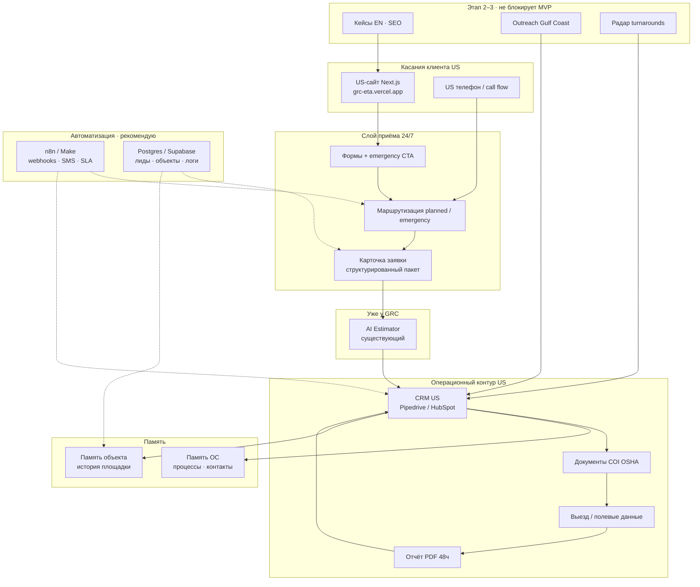

# GRC → US · техархитектура, сервисы, кто платит, смета работ

> **Только для вас.** Не для слайда GRC.  
> Основано на pitch (`lib/content.ts`), плане 3 этапов и текущем US-сайте (Next.js на Vercel).  
> Цифры — **оценка порядка величины** (USD/мес и часы), не договор. Уточнять после ответов на 5 вопросов из секции 06.

---

## 1. Что вы реально строите (одной фразой)

**Отдельный US pipeline:** витрина → приём 24/7 → (план / авария) → уже существующий AI Estimator → CRM → документы → выезд → отчёт → повтор.  
**Не** перестройка всего GRC в России. **Не** новый Estimator с нуля.

---

## 2. Референсная техархитектура (моё мнение)

### Принципы (как архитектору держать в голове)

| Принцип | Почему |
|---------|--------|
| **Один intake gateway** | Сайт `/contact` + телефон → одна карточка, не три человека в чатах |
| **CRM — source of truth для сделки** | Стадии B2B, PO, история; Estimator пишет **в** CRM |
| **Estimator не переписываем** | API / экспорт / ручной мост v1 — уточнить у GRC на встрече |
| **Emergency = измеримый SLA** | SMS + таймер 15 мин + эскалация — иначе «обещание в воздухе» |
| **Память объекта = CRM + файловое хранилище** | Не «ещё одна Excel» |
| **RU и US репозитории раздельно** | Уже так: `D:\Repair` (pitch), `D:\ArtemSite` (US site) |

### Стек по слоям (практичный MVP → зрелость)

| Слой | MVP (месяц 1) | Зрелость (4–6 мес) |
|------|---------------|---------------------|
| Витрина | Next.js 15, Vercel, Tailwind (есть) | Домен клиента, формы в prod, аналитика |
| Intake | Resend + serverless API **или** n8n webhook | Postgres + статусы + дедуп |
| Emergency | Twilio SMS + простые правила | On-call ротация, эскалация, логи |
| Estimator | Ручной / webhook / API (TBD) | Автопакет из intake |
| CRM | Pipedrive **или** HubSpot (1 воронка US) | Автоматизации стадий, отчёты |
| Документы | Google Drive / SharePoint папки + шаблоны | Генерация пакета по кнопке |
| Отчёты | Шаблон PDF (Notion → PDF / Google Docs) | Полуавто из фото с объекта |
| Память ОС | Notion / Confluence / CRM notes | Единая KB + связь с объектами |
| Outreach | CRM + Lemlist / Apollo **или** ручной Excel v1 | 50–200 касаний/нед с трекингом |
| Радар | Google Alerts + ручной список | Скрапер / отраслевые календари |

---

## 3. Какие сервисы нужны и сколько стоят (оценка USD)

Цены — **розница 2026**, без enterprise-скидок. Фактический счёт зависит от пользователей CRM и объёма SMS.

### A. Обязательные для US-контура (production)

| Сервис | Зачем | USD/мес | Кто платит (логично) |
|--------|-------|---------|----------------------|
| **Домен** `.com` | US brand, почта | ~$1–2 (годовой ÷12) | **GRC** |
| **Vercel** Pro (опц.) | US-сайт, preview, serverless | $0–20 | **GRC** (prod); на этапе demo вы могли платить сами |
| **Resend / SendGrid** | Письма с форм, уведомления | $0–20 | **GRC** |
| **Twilio** | SMS emergency, опц. US номер | $30–150 | **GRC** (usage) |
| **CRM** Pipedrive / HubSpot | Воронка US | $15–90 / seat | **GRC** |
| **Google Workspace** | `@company.com` US | $6–14 / user | **GRC** |
| **Хостинг БД** Supabase / Neon | Лиды, объекты, логи intake | $0–25 | **GRC** или **вы** (если включаете в фикс) |
| **n8n Cloud** или self-host | Связка intake→SMS→CRM | $0–50 | **GRC** (prod); настройку делаете **вы** |

**Итого инфраструктура GRC (без ваших часов):** примерно **$80–250/мес** на старте, **$200–500/мес** при активном outreach и нескольких seat CRM.

### B. Желательные (этап 2–3)

| Сервис | Зачем | USD/мес | Кто платит |
|--------|-------|---------|------------|
| **LinkedIn Sales Nav** | Outreach ЛПР Gulf Coast | ~$80–100 | **GRC** |
| **Apollo / Lemlist** | Email sequences | $50–150 | **GRC** |
| **QuickBooks** | Счета US | $30–90 | **GRC** |
| **Cloudflare** | DNS, CDN, WAF | $0–20 | **GRC** |
| **Sentry** | Ошибки сайта/API | $0 | **вы** (dev) или GRC |
| **Plausible / GA4** | Аналитика сайта | $0–10 | **GRC** |

### C. Что платите вы как исполнитель (типично)

| Статья | Зачем | USD/мес |
|--------|-------|---------|
| **Cursor / IDE / AI** | Разработка, контент | $20–40 |
| **Свой Vercel/GitHub** | Demo presentation + тесты | $0–20 |
| **Время** | Архитектура, интеграции, сайт | см. §5 — основная стоимость **ваша** |

На встрече честно: **подписки на prod — на стороне GRC**; вы продаёте **проектирование, сборку, интеграцию и сопровождение**.

---

## 4. Кто за что платит — матрица для разговора с GRC

| Категория | GRC (клиент) | Вы (исполнитель) |
|-----------|--------------|------------------|
| LLC, страховки, COI, OSHA реальные | ✓ | — |
| Домен, US телефон, CRM лицензии | ✓ | — |
| Twilio, email delivery, БД prod | ✓ | — |
| Кейсы, фото, переводы с 1grc.ru | ✓ (контент) | помогаете процессом |
| AI Estimator (уже есть) | ✓ хостинг у них | интеграция — ваши часы |
| Архитектура, n8n, код сайта, intake | — | ✓ (проект/ретейнер) |
| Pitch-презентация, demo RU/US | — | ✓ уже сделано |
| Outreach рассылки | ✓ подписки | ✓ настройка + скрипты |

**Правило для контракта:**  
- **CapEx/подписки** → счёт на **GRC**.  
- **Интеграция и изменения** → **ваш SOW** (фикс или T&M).  
- **Не смешивать** «$20 Vercel» внутри вашей сметы без пометки *rebillable* — иначе спорят на финале.

---

## 5. Смета вашей работы (часы и деньги)

Оценка **одного архитектора-интегратора** (вы), без отдельной команды dev+design.  
Диапазоны — чтобы на экране было с чем сравнить; **не оферта**.

### 5.1 Трудозатраты по этапам pitch

| Этап | Срок | Часы (мин–макс) | Что входит |
|------|------|-----------------|------------|
| **0. Уже сделано** | до pitch | **80–120** | Презентация, US demo site, RU demo, аудиты, слайд архитектуры, Obsidian |
| **1. База** | Мес. 1 | **100–140** | Intake prod, emergency SMS, CRM воронка, связка сайта, мост к Estimator, диспетчеризация |
| **2. Видимость** | Мес. 2–3 | **60–90** | Кейсы EN, SEO, LinkedIn процесс, outreach templates, CRM отчёты |
| **3. Зрелость** | Мес. 4–6 | **80–120** | Радар v1, пакет документов, PDF отчёт SLA, память ОС/объекта |
| **Сопровождение** | 6 мес | **20–40** | Созвоны, правки, инциденты |
| **ИТОГО** | 6 мес | **340–510** | С учётом уже вложенного в pitch |

### 5.2 Деньги (три сценария ставки)

Ставка ориентир для **архитектора B2B / industrial**, remote, US-facing:

| Сценарий | $/час | Только этапы 1–3 (260–390 ч) | Всё с pitch (340–510 ч) |
|----------|-------|------------------------------|-------------------------|
| **Консервативный** | $60 | $16k – $23k | $20k – $31k |
| **Базовый** | $85 | $22k – $33k | $29k – $43k |
| **Премиум** | $110 | $29k – $43k | $37k – $56k |

**Фикс-пакеты (альтернатива T&M):**

| Пакет | Содержание | Фикс USD |
|-------|------------|----------|
| **MVP US Contour** | Этап 1 + 30 дней поддержки | $22k – $28k |
| **Growth** | Этап 1–2 | $32k – $42k |
| **Full 6 mo** | Этап 1–3 + документация | $45k – $58k |

*В рублях:* умножить на курс; при $85/ч и 400 ч ≈ **$34k** (~3.4M ₽ при 100 ₽/$ — **курс уточнять на дату договора**).

### 5.3 Что **не** включено (вынести в доп. или GRC)

- Лицензии CRM, Twilio, домен, реклама LinkedIn  
- Юрист US (LLC уже есть у них или нет — уточнить)  
- Переводчики EN для длинных кейсов  
- Полевые съёмки, фото бригад  
- Разработка **нового** Estimator с нуля  
- 24/7 живой call-центр (только **процесс + автоматизация**)

### 5.4 Как озвучить GRC одной фразой

> «Подписки и телефон — ваши, порядка **$150–300 в месяц** на старте. Моя работа — спроектировать и собрать контур за **X месяцев**, это **Y долларов** фиксом по этапам или по факту часов с потолком.»

---

## 6. Риски, от которых съезжает смета

| Риск | Влияние на часы | Что спросить на встрече |
|------|-----------------|-------------------------|
| Estimator без API | +40–80 ч на ручные мосты | Вопрос 3 в pitch §06 |
| Emergency «кому SMS» не решено | +20 ч переделок | Вопрос 2 §06 |
| CRM выберут поздно | +15 ч миграция | Зафиксировать до этапа 1 |
| GRC не даёт кейсы/фото | этап 2 стоит, но не конвертит | Вопрос 5 §06 |
| Scope creep «перестройте RU» | +∞ | Scope D — только US pipeline |

---

## 7. Рекомендуемый порядок работ (когда вернётесь)

1. Закрыть **5 вопросов** из §06 презентации → зафиксировать в 1-pager SOW.  
2. Подписать **кто платит подписки** (матрица §4).  
3. Этап 1: intake + Twilio + CRM + минимальный мост Estimator.  
4. Параллельно: домен, формы prod на US-сайте.  
5. Этап 2–3 — только после **первого лида в CRM**.

---

## 8. Связанные файлы

- [[GRC → US — полный хаб Obsidian]]  
- [[GRC — сайт США]]  
- `lib/content.ts` → `planStages`, `systemModules`  
- Презентация live: Vercel deployment из `zobnin8-ux/presentation`

---

## 9. TL;DR на экране

| | |
|--|--|
| **Архитектура** | Сайт + intake + (planned/emergency) → Estimator (у GRC) → CRM → docs → field → PDF → repeat; память ОС/объекта; n8n + DB как клей |
| **Сервисы GRC** | ~**$80–250/мес** старт |
| **Платит GRC** | Домен, CRM, Twilio, Workspace, контент, подписки |
| **Платите вы** | Часы/фикс за интеграцию; свои dev-инструменты |
| **Ваша работа 6 мес** | **~260–390 ч** (без pitch) · **$22k–43k** при $85/ч |
| **Уже вложено в pitch** | **~80–120 ч** сверху |

---

*Документ v1.0 · пересмотреть после встречи с GRC и ответа по Estimator API.*
